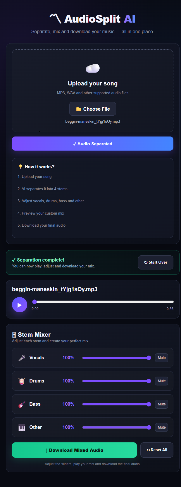

# AudioSplitAI

AudioSplitAI is an AI-powered audio source separation and mixing application. It allows users to upload a music track, separate it into individual audio stems, control each stem independently, preview the customized mix, and download the separated audio.

The application combines a FastAPI backend with the Demucs source-separation model and a browser-based audio mixer.

---

## Project Preview



---

## Features

- Upload audio files through a web interface
- Support for MP3, WAV, M4A, FLAC, OGG, and AAC formats
- AI-powered audio source separation using Demucs
- Separate music into four individual stems:
  - Vocals
  - Drums
  - Bass
  - Other
- Browser-based audio playback
- Independent volume control for each stem
- Mute individual stems
- Create a customized audio mix
- Preview the customized mix directly in the browser
- Download individual separated stems
- Download the final mixed audio
- Responsive dark-themed interface
- FastAPI REST API
- Swagger/OpenAPI API documentation
- File validation
- Safe filename handling
- Output validation
- Cached separation results to avoid unnecessary processing

---

## Technologies Used

### Backend

- Python
- FastAPI
- Uvicorn
- Python Multipart

### AI / Audio Processing

- Demucs
- PyTorch

### Frontend

- HTML
- CSS
- JavaScript
- Browser Audio API

### Development Tools

- Visual Studio Code
- Git
- GitHub

---

## Project Architecture

```text
                         User
                           |
                           v
                  Web Interface
                HTML + CSS + JavaScript
                           |
                           v
                    FastAPI Backend
                           |
             +-------------+-------------+
             |                           |
             v                           v
       File Validation              Cached Results
             |
             v
       Uploaded Audio
             |
             v
       Demucs AI Model
             |
             v
    +--------+--------+--------+
    |        |        |        |
    v        v        v        v
 Vocals    Drums     Bass     Other
    |        |        |        |
    +--------+--------+--------+
             |
             v
        Browser Mixer
             |
             v
      Customized Audio Mix
             |
             v
       Download / Preview